# 🎬 BookShow – Full Stack Movie Ticket Booking Platform

🚀 A modern, scalable MERN stack application for seamless movie ticket booking with real-time seat selection and admin management.

---

## 🔥 Live Demo

- 🌐 Frontend: https://book-show-1.vercel.app  
- ⚙️ Backend API: https://your-backend-url.onrender.com  
- 💻 Repository: https://github.com/36-maulya/book_show_1  

---

## 🧠 Project Highlights

- 🎟️ Real-world ticket booking workflow  
- 🪑 Interactive seat selection system  
- 🔐 Secure authentication & authorization  
- 📊 Admin dashboard for full control  
- ⚡ Optimized frontend performance  
- 🌍 Fully deployed using Vercel & Render  

---

## 📸 Screenshots

### 🏠 Home Page

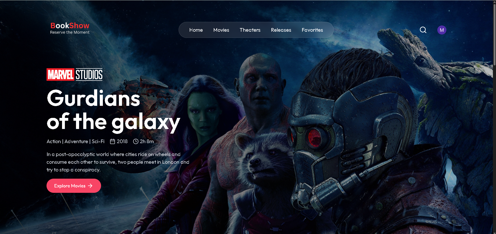
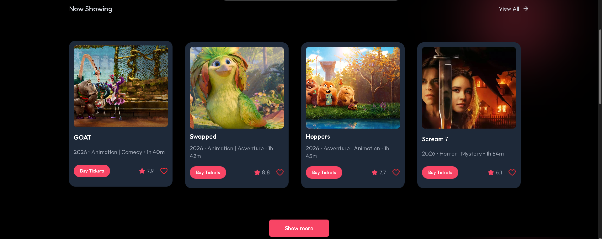
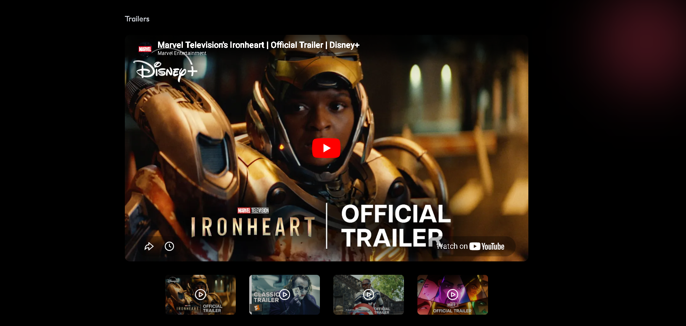

### 🎬 Movie Listing

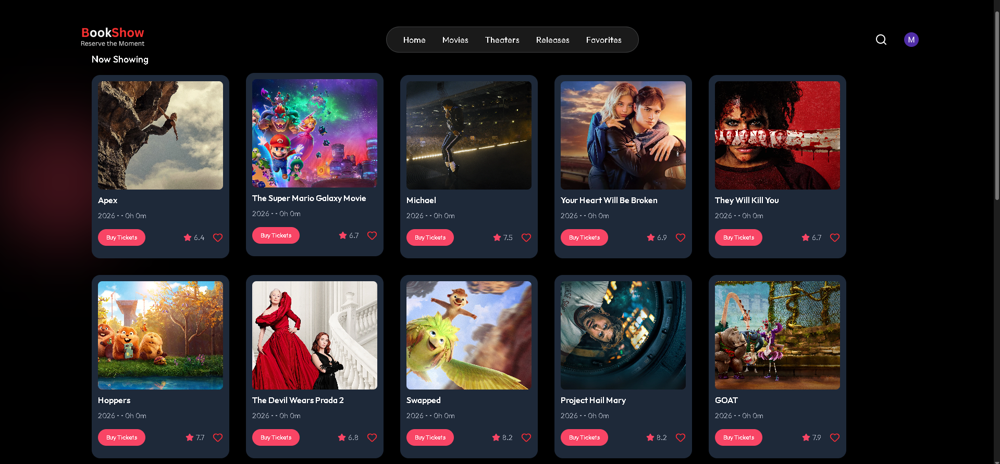
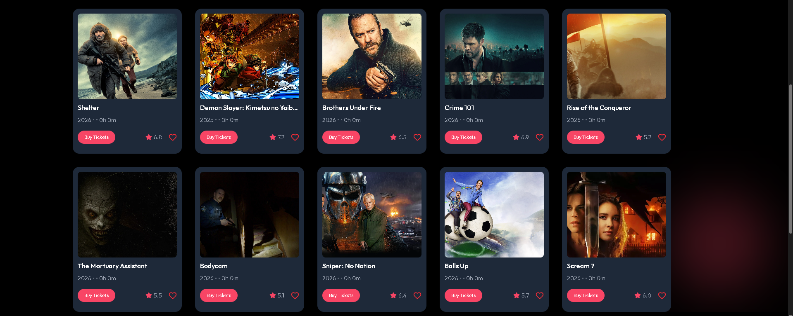
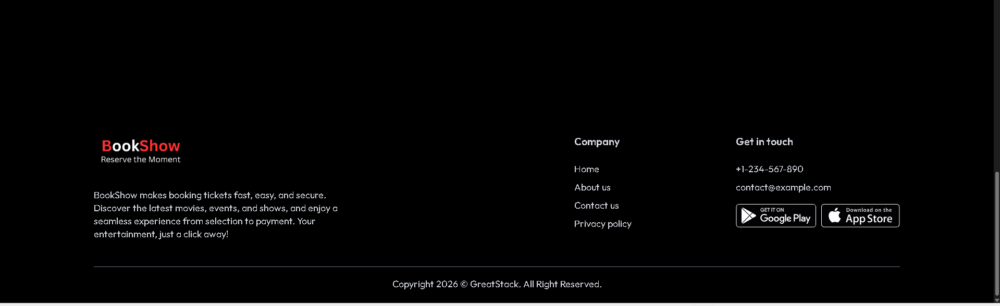

### 📄 Movie Details

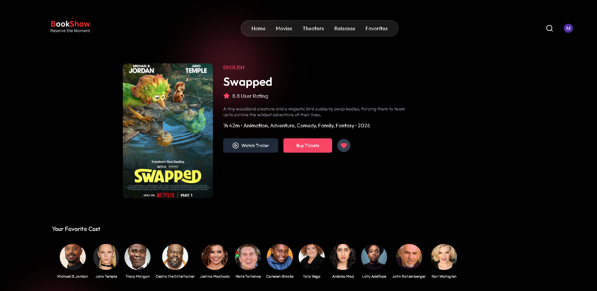
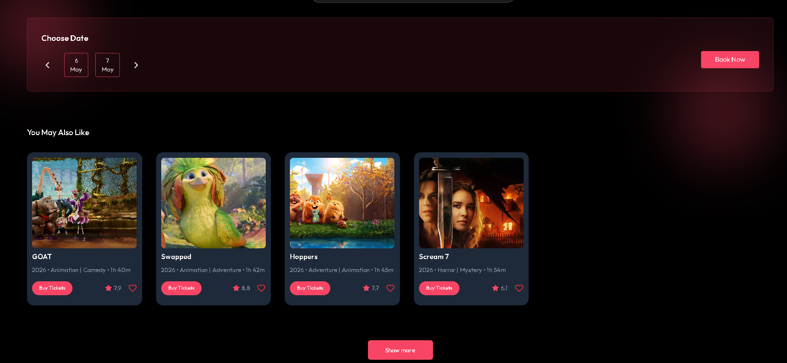

### 🪑 Seat Selection

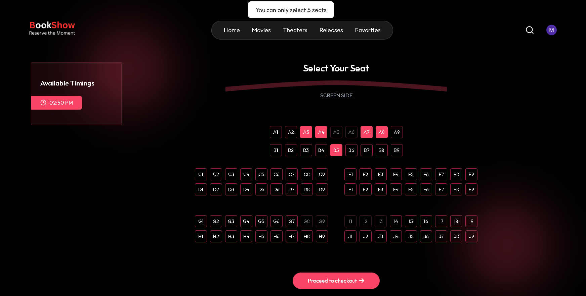

### 🎟️ Booking Page

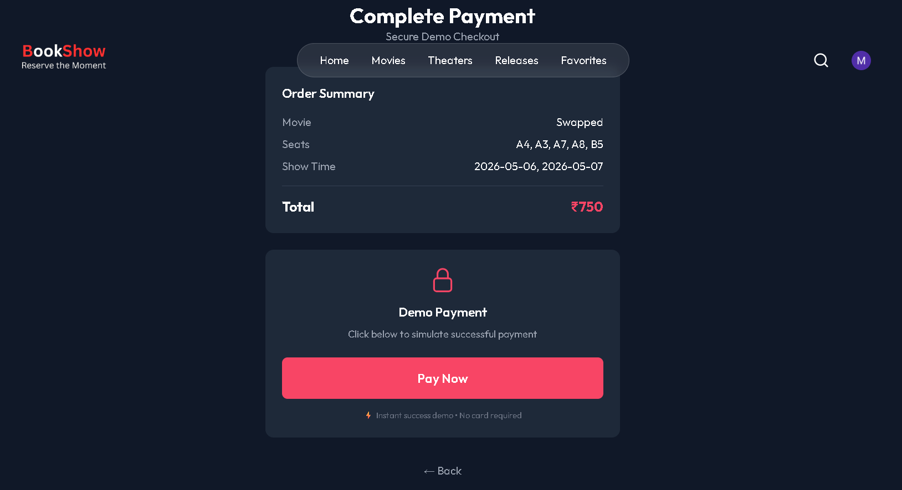

### 📂 User Bookings

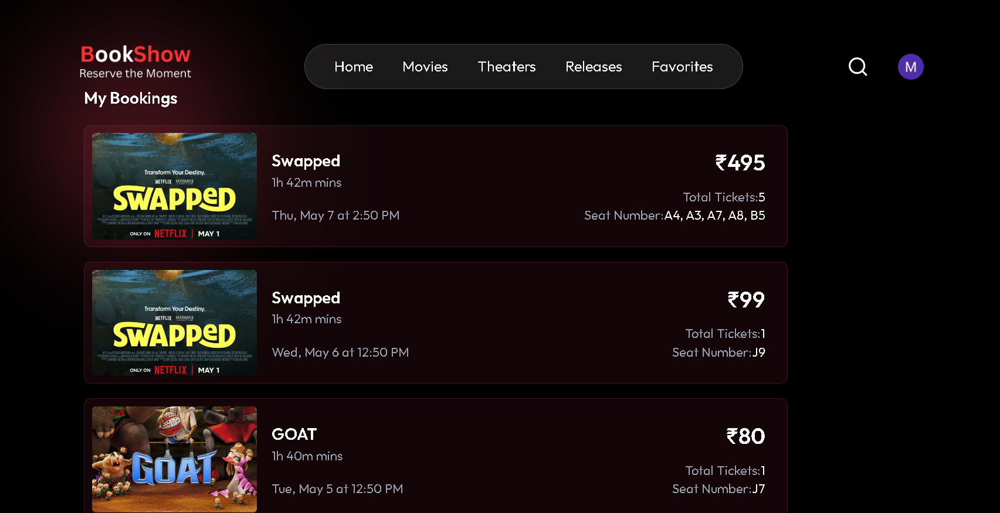

### 👨‍💼 Admin Dashboard

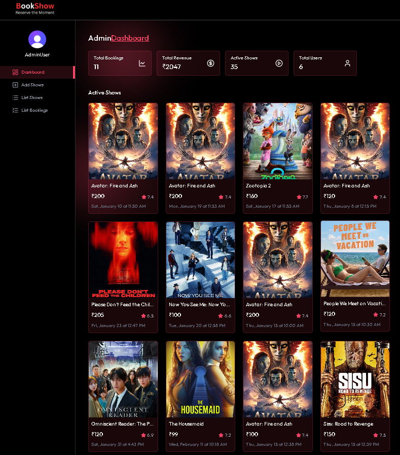
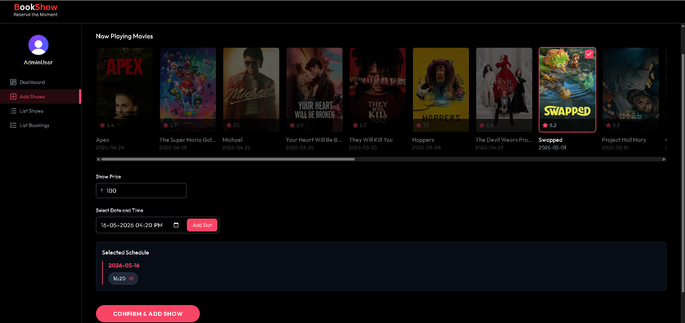
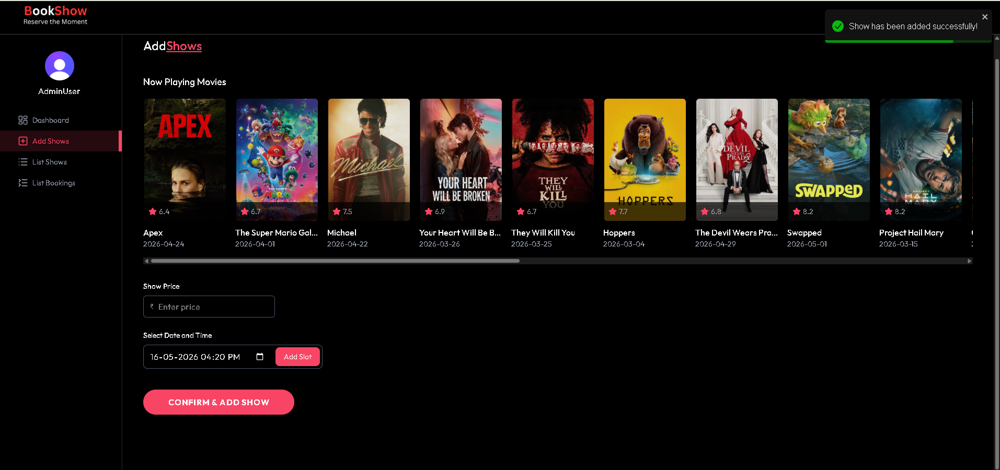
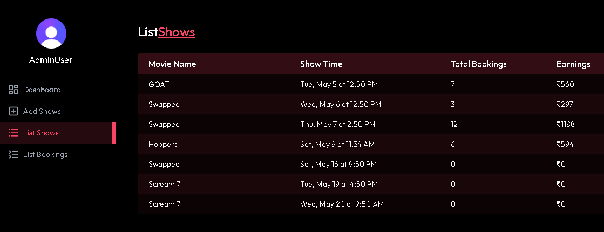
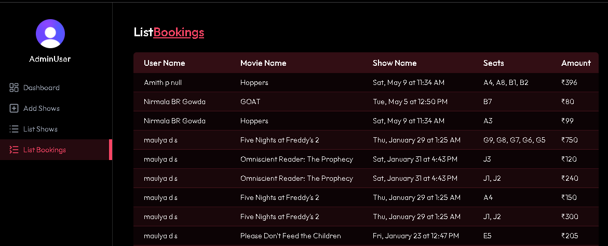

---

## 🎥 Demo (Optional but Powerful)

👉 Add a screen recording GIF here (very important for recruiters)

Example:

---

## 🏗️ System Architecture

Client (React) → REST API (Node.js/Express) → Database (MongoDB)

---

## ✨ Features

### 👤 User Side
- 🔐 Login / Signup  
- 🎬 Browse movies  
- 🔍 Search functionality  
- 📄 Movie details page  
- 🪑 Seat selection  
- 🎟️ Ticket booking  
- 📂 Booking history  

### 👨‍💼 Admin Panel
- ➕ Add / Update / Delete movies  
- 🎭 Manage shows  
- 📊 View bookings  

---

## ⚙️ Tech Stack

Frontend: React.js, Tailwind CSS  
Backend: Node.js, Express.js  
Database: MongoDB  
Deployment: Vercel, Render  

---

## 📁 Project Structure

book_show_1/  
├── client/  
├── server/  
└── README.md  

---

## ⚡ Getting Started

### Clone Repo
git clone https://github.com/36-maulya/book_show_1.git  
cd book_show_1  

### Install Dependencies

Frontend  
cd client  
npm install  

Backend  
cd server  
npm install  

---

### Environment Variables

Create `.env` in server:

MONGO_URI=your_mongodb_uri  
JWT_SECRET=your_secret  
PORT=5000  

---

### Run Locally

Backend  
cd server  
npm run dev  

Frontend  
cd client  
npm run dev  

---

## 📈 Why This Project Stands Out

- 💡 Real-world application  
- 🧩 Full-stack implementation  
- 🔄 CRUD + Authentication  
- 📦 Production-ready  
- 🎯 Strong placement project  

---

## 🚀 Future Enhancements

- 💳 Payment Integration  
- 🎥 Trailer support  
- ⭐ Ratings & reviews  
- 📱 Mobile optimization  

---

## 👨‍💻 Author

Maulya D S  
https://github.com/36-maulya  

---

## ⭐ Support

If you like this project, give it a ⭐ on GitHub!
